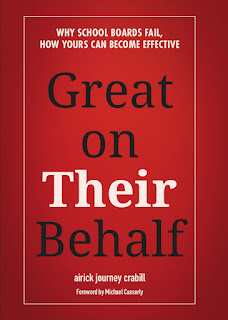
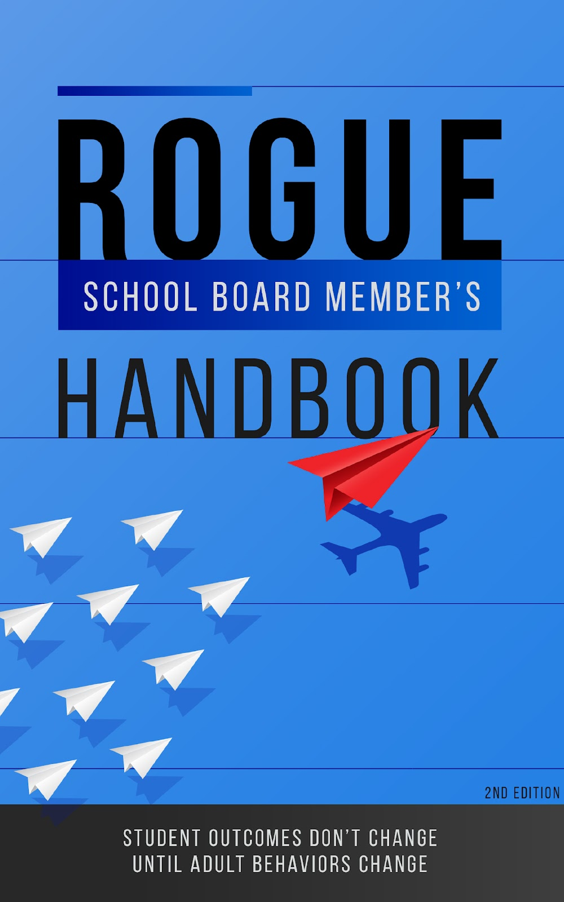

  

      <!---  
    -->
   
  
       
      <ul><li>Foreword by Michael Casserly</li><li>Read a <a href="http://www.greatontheirbehalf.com">sample</a></li><li><a href="https://www.amazon.com/Great-Their-Behalf-School-Effective/dp/154453759X/">Available Now!</a></li></ul>
 

   
   

       
      <ul><li>Chapter 16:&nbsp;School Board Leadership to Improve Student Outcome, By AJ Crabill</li>
 <li><a href="https://www.amazon.com/Leadership-Interdisciplinary-Approach-Denver-Fowler/dp/B0BKHW457G" target="_blank">Available now</a></li></ul>
 

   
 

       
    <ul><li>Rogue School Board Member's Handbook</li>
     <li>Available September 2024</li></ul>
 

<!-- 
-->

